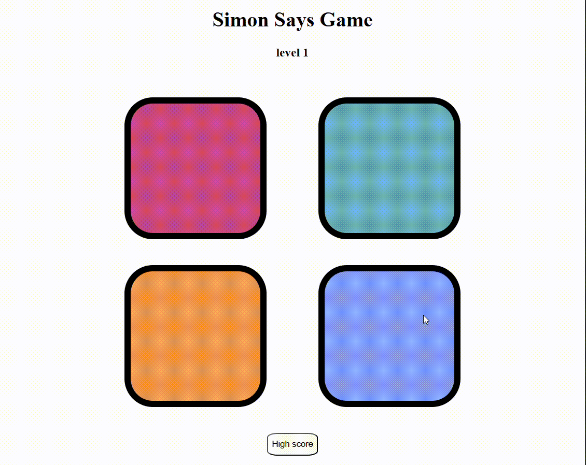

# 🎮 Simon Says Game

A fun and interactive memory game built using **HTML, CSS, and JavaScript**.  
The goal is simple: **watch the color sequence, remember it, and repeat it!**  
Each round adds a new color to the sequence — how far can you go?

---

## 🌟 Features

- 🔁 Increasing difficulty as the game progresses
- 🎨 Colorful and engaging UI
- 🔊 Sound effects for each button
- 💻 Fully responsive and mobile-friendly
- 🧠 Built using only vanilla HTML, CSS, and JavaScript

---

## 📸 Demo

  

---

## 🧱 Tech Stack

- **Frontend:** HTML5, CSS3, JavaScript (Vanilla)
- No external libraries or frameworks used

---

## 🚀 How to Play

1. Click anywhere on the screen to start the game.
2. Watch the color pattern that lights up.
3. Repeat the pattern by clicking the colors in the correct order.
4. The sequence gets longer with each round.
5. One mistake and it's game over!

